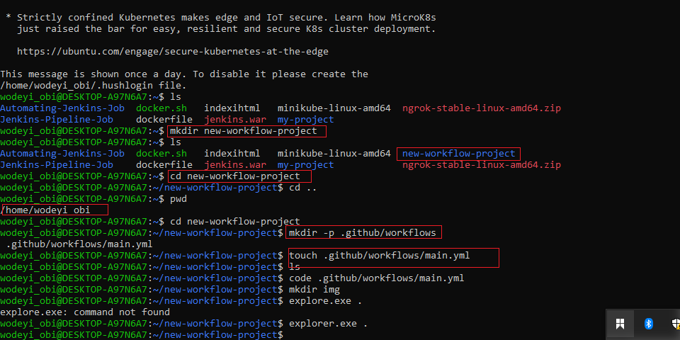
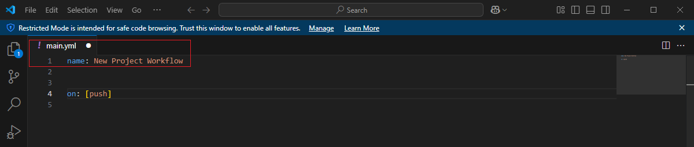
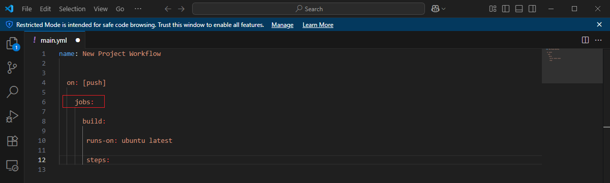
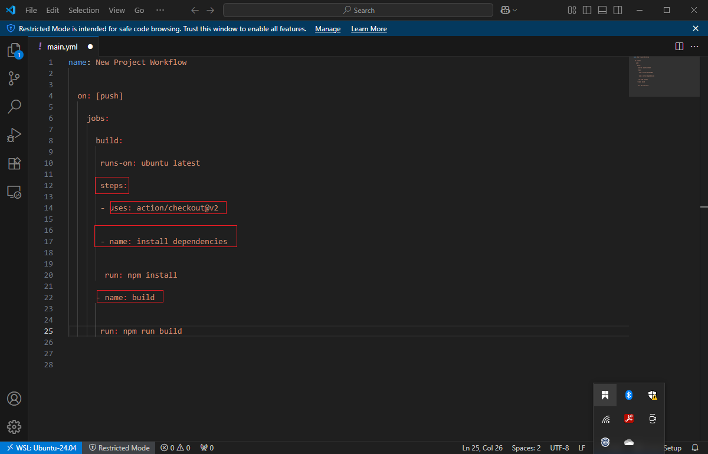
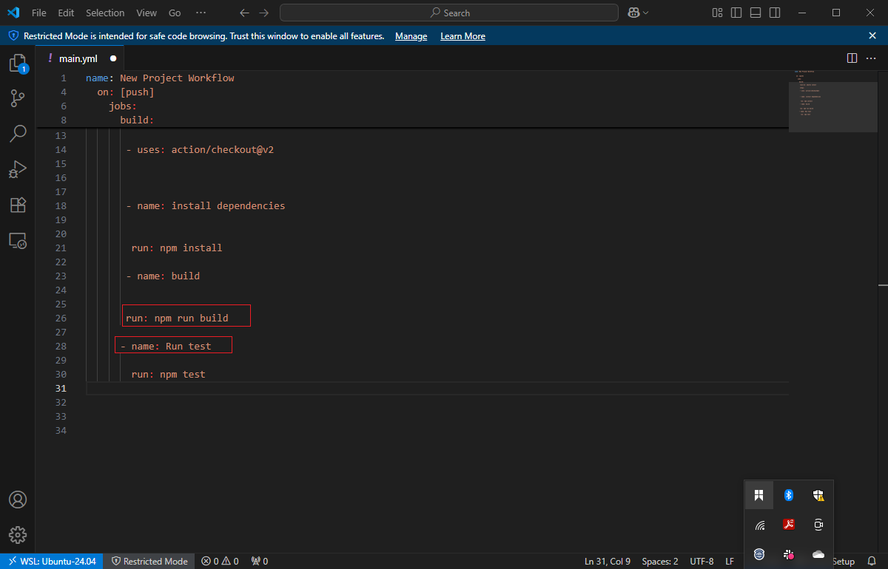
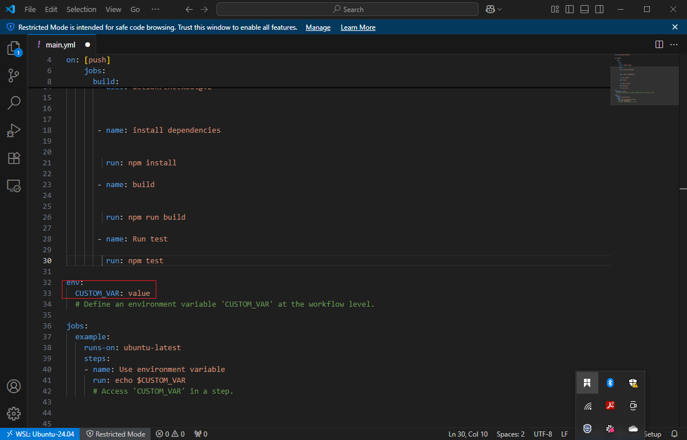
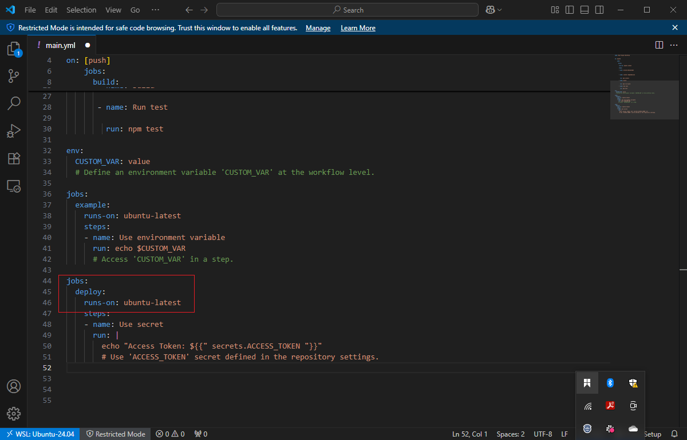
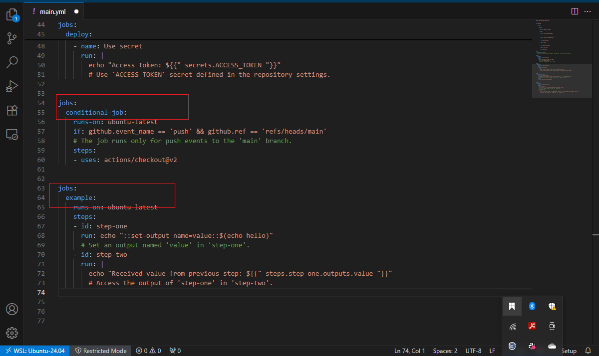

# 🚀 GitHub Actions & CI/CD Course Project – YAML

Welcome to this **engaging and practical course** on **GitHub Actions** and **Continuous Integration / Continuous Deployment (CI/CD)**. In this project, you will embark on a journey to **master the art of automating software development workflows** using YAML—the configuration language that powers GitHub Actions.

Whether you're a **seasoned developer** or a **complete beginner**, this project is designed to equip you with the **essential CI/CD skills** needed in today’s modern DevOps pipelines.

---

## 📘 Course Overview

This course project provides a hands-on approach to learning:
- 📁 Structuring workflows using `.github/workflows/*.yml` files  
- ⚙️ Automating build, test, and deployment processes  
- 🔄 Leveraging **GitHub Actions** for smart CI pipelines  
- ✅ Configuring **build matrices** for multiple environments  
- 🚀 Deploying applications through workflow automation

---

## 📌 What You'll Learn

1. **Introduction to YAML Syntax**
2. **Workflow Syntax and Structure**
3. **Setting Up GitHub Actions**
4. **Configuring Build Matrices**
5. **Testing with GitHub Actions**
6. **Automating Builds and Deployment**
7. **Managing Secrets and Environments**
8. **Best Practices for CI/CD Pipelines**

---

## 🛠 Project Structure

```bash
my-project/
├── .github/
│   └── workflows/
│       └── main.yml         # CI workflow configuration
├── index.js                 # Sample Node.js app (example)
├── package.json             # Project dependencies and scripts
├── test/
│   └── app.test.js          # Unit test example
└── README.md                # Course project documentation

```
----



## Writing ot the YAML file



## Writing Jobs



## Writing steps



## Writing build



## Environment configuration



## Secret Token



## Event




